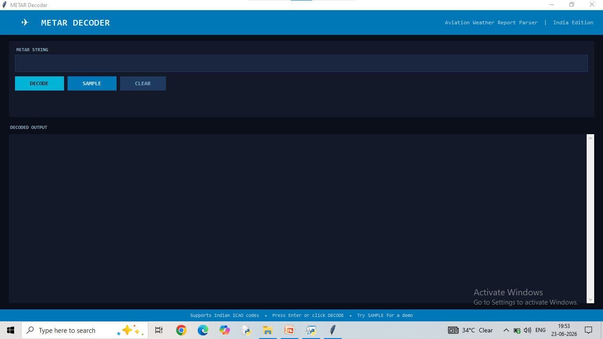

# Python-METAR-Decoder
A Python application to decode METAR (Meteorological Aereodrome Report) weather reports into human-readable information .
## Features 
- decode METAR weather reports
- Easy-to-use Python application
- Fast and Accurate decoding
  ## Technologies Used
  - Python
  - Tkinter
    ## Project Screenshots
    ### Output 1
    

    ### Output 2
    ! [Output 2 ](met4.png)
    
  ## Author
  Akash Rai
  BTech Electronics and Communication Engineering (ECE)
    
